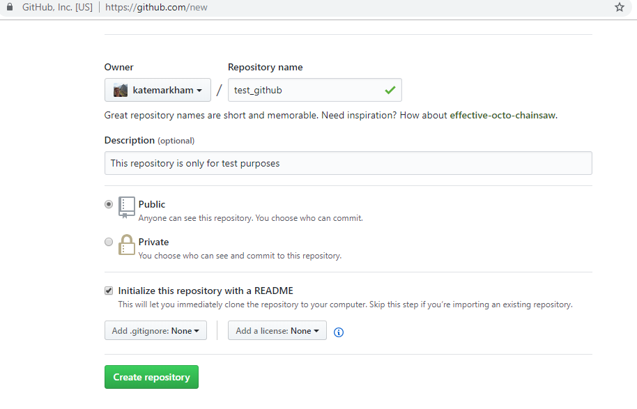
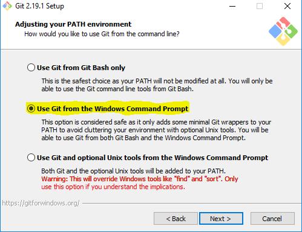
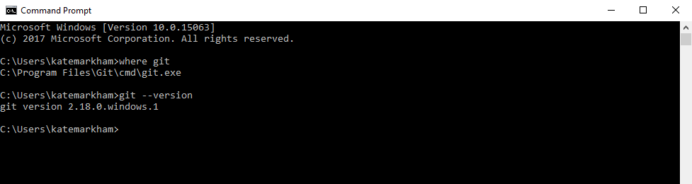
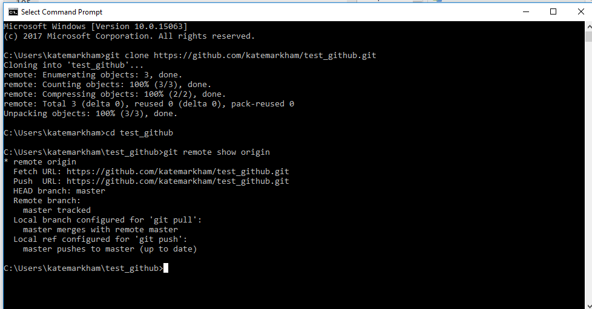
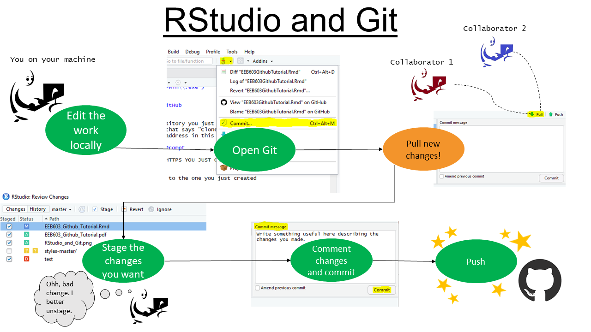

\newpage
##Set-up in R
setwd(H:/Coursework/EEB603/gitHubRStudio)

###Load necessary R packages
```{r echo=FALSE, include=FALSE}
if(!require("knitr")) install.packages("knitr")
if(!require("knitcitations")) install.packages("knitcitations")
if(!require("bookdown")) install.packages("bookdown")
if(!require("kfigr")) install.packages("kfigr")


library(knitr)
library(knitcitations)
library(bookdown)
library(kfigr)
```

```{r global options, include=FALSE}
library(knitr)
knitr::opts_chunk$set(fig.pos = '!h')

```


##Aims of this tutorial
-Understand what GitHub is, and when and why you would use it
-Set up your own GitHub account, install Git, connect with RStudio


#Introduction
To follow along, go to http://rpubs.com/jmwiniarski/githubpres  

##What is GitHub
Git is a version control system for tracking files and collaborating with others. 

Version control is the management of changes to whatever (code, document, website, etc.). It's sort of like Track Changes in Microsoft Word but much better.

GitHub is the web-based hosting service for Git.

Git was started in 2005 originally for Linux. GitHub launched in 2008. 

##Why use Github/RStudio?
Manage evolution and changes of data files - reports, figures, code, data (i.e., repositories)

Allows others to see your work, adopt your code in their projects, or let others you are collaborating with make changes

Allows you to track your changes easily, don't need ten million versions saved on your computer/drive, can find changes you made months ago,  

It is FREE 

Pretty user-friendly

All the cool kids are doing it (seriously, take ecology out of the dark ages)

#Creating an account
#####Online

##GitHub account
First register for a GitHub account at http://www.github.com

Next, we will create a test repository that we will return to later.

##Create a test repository:  
1. Click on your profile  
2. Click "Repositories" at the top  
3. Click the green button "New"  
4. Name your repository "test_github", write a short description of the repository, make it public, and select initalize with a README, finally select "Create repository" (Refer to Figure 1)  

Again, we will return to this repository later in the tutorial.

```{r figure1, echo=FALSE, fig.cap="Creating a repository", out.width = '100%'}

```


#Installing Git on your computer
*In our opinion, the best guide is 'happygitwithr' by Jenny Bryan: http://happygitwithr.com/ and we recommend having it handy nearby*

**Follow directions exactly.**
Note that install instructions differ for Mac, Windows, and Linux.

#####On your computer
For PCs:  
1. Open the Command Prompt (use the magnifying glass to search for it if you've never used it before)  
2. First, check that Git isn't already installed by typing in your command prompt:  
where git  
If you have it installed, go to step 4.  
3. If you don't have Git, install it from this website: https://gitforwindows.org/ *Install Git into the Program Files folder on your C drive so RStudio can find it.*  
After the "GNU General Public License" , keep the default options for the next two screens, then for "Adjusting your PATH environment", select "Use Git from the Windows Command Prompt" (Figure 2),  

```{r figure2, echo=FALSE, fig.cap="Adjusting your path environment", out.width = '100%'}

```

and then continue and keep the remaining defaults.  
5. In your Command Prompt, type  
git --version  
to check that your install was successful (see Figure 3)  
```{r figure3, echo=FALSE, fig.cap="What to type in the command prompt", out.width = '100%'}

```
*If you were not successful, please note that spaces are meaningful when working in Command Prompt and capitalization matters. Make sure you do not have any typos and/or extra spaces.*


#Connect RStudio with GitHub

#####In R
1. Navigate to the repository you just created  
2. Click the green box that says "Clone or download"  
3. Copy the full https address in this box  

#####Return to Command Prompt
1.Type  
git clone  
AND THEN THE HTTPS YOU JUST GRABBED  
2. Type  
cd test_github  
to change the directory to the one you just created  
3. Type  
git remote show origin  
to check the connection to GitHub  

```{r figure4, echo=FALSE, fig.cap="Connecting your repository to Git", out.width = '100%'}

```

*If you were not successful, please note that spaces are meaningful when working in Command Prompt and capitalization matters. Make sure you do not have any typos and/or extra spaces.*

#####In R
1.File > **New Project** > Version Control > Git  
2. Paste repository URL (This autofills project directory name)  
3. Pick a directory on your computer and remember where this directory is  
4. Create project  


#Repository options
1. Go to your online github account and navigate to your repositories  
2. Click your test_github repository  
3. Click Settings  

###To change the name of your repository 
1.The first option under Settings allows you to type in a new name for your repository

###To add a collaborator
1. On the lefthand side of Settings, select "Collaborators"  
2. Include either the username or email address of the person you wish to collaborate with **Email addresses will only work if the user has chosen to make their email address public

##Creating a branch
Branches of a repository allow you to work on the code without changing the master branch. 

For example, many packages on GitHub will have a master branch and a developer branch. The developer branch is often a work in progress whereas the master branch is the version users not looking to edit the package will download.

To create a branch from GitHub  
1. Navigate to the repository on GitHub  
2. Click Branch:master  
3. In the drop-down menu, type in whatever you want the name of your new branch to be  

##Pulling, pushing, etc.
Once you've edited the file and are ready to share it, click the Git button in RStudio

1. Select Commit  
2. First, check that you aren't missing any changes from collaborators and pull. This small step makes sure you don't jump ahead of your colleagues and then need to backtrack and merge projects that no longer line up correctly.  
3. Select the changes you want to share by staging them. Additions are in green and deletions are in red. Note: you can stage entire files or you can stage chunks of code or even lines of code. What is staged is shared, what is unstaged is not.  
4. Comment your changes. Tip: write something meaningful you will understand later and that is useful to collaborators.  
6. Commit your changes.  
7. Push your changes. **This is when your work goes to the GitHub repository!**  

```{r figure5, echo=FALSE, fig.cap="Sharing your code with RStudio and Git", out.width = '100%'}

```

##.gitignore
If you have files that you want to keep on your local machine but do not want to share to GitHub for whatever reason, you can do this through your .gitignore file within your repository.

#####On your local machine
1. Navigate to where your repository is on your machine and  open .gitignore in a text editor  
2. Add the file you want to ignore  
3. Save it  


#####On GitHub
1. Navigate to your repository and open .gitignore
2. Click the pencil next to the trashcan symbol 
3. Add the file you want to ignore


##Paid repository options
Some of the features on GitHub require a paid plan.
https://github.com/pricing

1. Private repositories  
2. Team permissions  
3. Backups  

#To create a repository from an existing project

##Create the remote repository online:  
1. Click on your profile  
2. Click "Repositories" at the top  
3. Click the green button "New"   
4. Unlike previously, do not initialize with a README
##### On Git Bash/Command Prompt
5. Go to Git Bash  
6. Check your current working directory by typing  
pwd  
7. Find the path name for your local repository  
6. Type the full folder name 
cd  H:/Coursework/EEB603/gitHubRStudio  
7. Type  
git init  
to initialize your repository  
8. Add the files within your local repository by typing
git add .  
and make sure the spacing matches!  
9. Type  
git commit -m "This is my first commit"  
to write a comment for your commit  
10. Copy the url for your repository from GitHub, the one you just created  
11. Type  
git remote add origin AND THEN THE URL    
12. Type  
git remote -v  
to verify the new remote URL
13. Push the changes by typing  
git push -u origin    

For more help, see here https://help.github.com/articles/adding-an-existing-project-to-github-using-the-command-line/  

If you get an error that "remote origin already exists" try  
git remote set-url origin AND THEN THE URL

##Student Developer Pack
https://education.github.com/pack

With the student developer pack, users have  
1. Unlimited private repositories  
2. Unlimited collaborators  


##Recommended web resources
http://happygitwithr.com/  
http://r-bio.github.io/intro-git-rstudio/  
https://services.github.com/on-demand/resources/  
https://www.atlassian.com/git/tutorials/atlassian-git-cheatsheet  
https://guides.github.com/activities/hello-world/  

#Glossary
**Branch**-Parallel version of a repository. Working on a branch allows you to work without changing the live version on the master branch.  
**Clone**-Copy of a reposity that is on your machine rather than on the server. (Can also act as a verb.) You can sync changes in your cloned copy to remote versions when you are online.  
**Commit**-Changes to a file. It's similar to a "save as"" but you do not need to rename the file (Git automatically keeps track of each change).  
**Fetch**-Grabbing the latest version from an online repository-does not automatically merge this version with your own.  
**Fork**-Your own copy of another user's repository that remains on your own account. This allows you to make changes without affecting the original. You can pull updates from the original user's repository.  
**Pull**-Grabs new changes and merges them with your own copies. If you need to grab new changes but not merge them, see "fetch."  
**Push**- Send your changes to a remote repository. If you make changes and you want your collaborators to see them, you need to push your changes.  
**Repository**-The place where all of the project's files are stored. A repository also records the file's revision history. Can be public or private and can have multuple collaborators.  

For more terms, see https://help.github.com/articles/github-glossary/

#References
